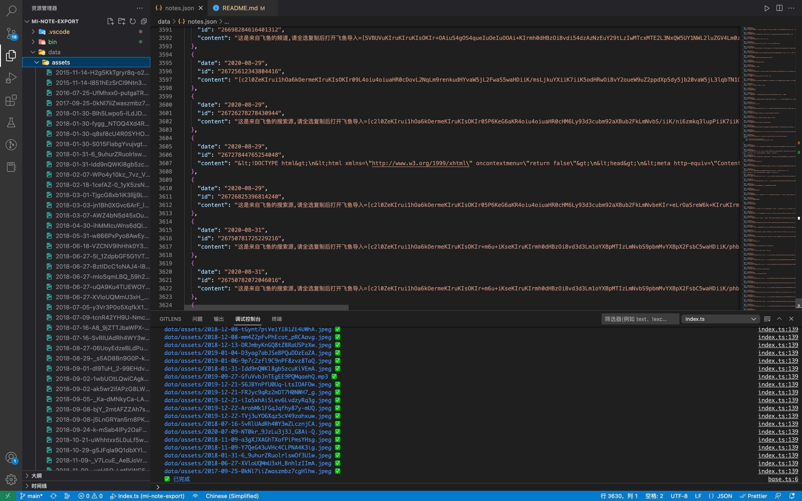

# 🔧 小米云服务便签批量导出工具

一键批量备份小米云服务云便签（包含图片，录音等文件）

## ✨ 动机

犹记得我最后一部使用过的小米手机是，红米 note 4X，当年的千元机之王，陪我走过了大学的青春岁月，记录了许多美好回忆。

不过自从大学毕业后，我就再也没有用过小米手机。直到有一天，邮箱里收到了，小米云服务存储数据即将清空的邮件，WTF！


本以为云服务里的数据是永久保存的，得亏我经常看邮件，不然一个月之后，里面存的便签和短信记录就都被清空了～

但最蛋疼的是，这丫不支持批量导出便笺/笔记！！！ 没办法，只能自己造轮子了～

## 💡 使用方法

首先，在浏览器登录你的小米云服务账号。

然后，复制 cookie 到 `.env` 文件中（参考 `.env.example`）

最后，运行以下命令：

```bash
yarn && yarn dev
```


不出意外，你的便签数据就会备份到 `data/notes.json` 文件里了。



PS: 便签中的图片，音频等文件，下载到了 `data/assets` 目录下。

## License

MIT License © 2022-PRESENT [Del Wang](https://del.wang)
