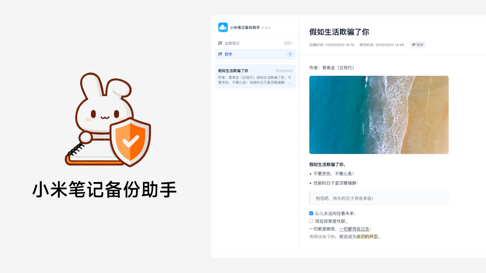
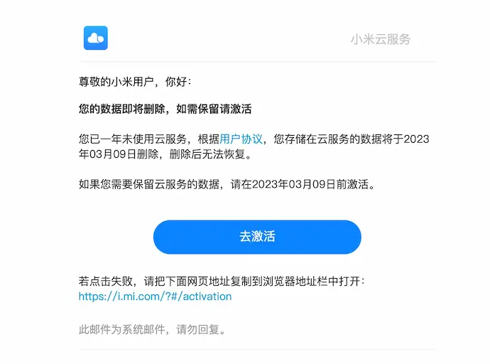

# 🐰 小米笔记备份助手

一键批量备份小米笔记（包含图片、录音等文件），支持导出为 Markdown 格式，并按文件夹分类整理。



## 项目亮点

1. 一键批量备份小米笔记 + 文件（图片/视频/录音）
2. 自动保存笔记为 Markdown 格式，方便导入其他应用
3. 内置网页管理界面，可在线浏览笔记，完美还原笔记排版
4. 支持增量更新，自动检测并处理笔记和文件夹的重命名和删除

## 项目背景

犹记得我使用过的最后一部小米手机是 [红米 Note 4X](https://www.mi.com/redminote4x) —— 当年的千元机性价比之王，陪我走过了大学的青春岁月，记录了许多美好回忆。不过毕业之后，我就再没用过小米手机。

直到有一天，我在邮箱里收到了「小米云服务存储数据即将清空」的通知邮件。



我原以为小米云服务里的数据是永久保存的，原来长时间不用会被清空。

幸好我有经常看邮件的习惯，不然一个月之后就追悔莫及了。

遗憾的是，官方并没有提供「批量导出笔记」的功能。

没办法，只能自己造轮子了～

## 快速开始

首先，克隆项目到本地，并按教程获取并更新 [env](./env) 配置文件中的 [Cookie](https://github.com/idootop/mi-note-export/issues/4)。

```bash
# 克隆项目源码
git clone https://github.com/idootop/mi-note-export.git

# 进入项目根目录
cd mi-note-export
```

保存 [Cookie](https://github.com/idootop/mi-note-export/issues/4) 到 env 文件之后，运行以下命令同步笔记数据，打开网页 http://localhost:3000 即可查看。

```bash
# 同步最新笔记数据
docker run -it --rm --env-file $(pwd)/env -v $(pwd)/public/data:/app/public/data idootop/mi-note-sync:latest

# 打开网页查看笔记 http://localhost:3000
docker run -it --rm --init -p 3000:3000 -v $(pwd)/public/data:/home/static/data idootop/mi-note-web:latest
```

如果你有 [Node.js](https://nodejs.org/zh-cn/download) 运行环境，也可以直接运行该项目，无需下载 Docker 镜像。

```bash
# 安装依赖并运行
pnpm install && pnpm start
```

## 常见问题

### Markdown 格式的笔记保存在哪里？

笔记数据下载完成后，会将 Markdown 格式的笔记文件保存到 `public/data/markdown` 目录下。

笔记中的图片、录音等文件，则保存在 `public/data/assets` 目录。

### 401 Unauthorized Error: 获取笔记列表失败

你还没有设置 Cookie 或者 Cookie 已过期。

请刷新网页，按教程重新获取 Cookie 后，更新到 [env](./env) 文件中重新运行。

### 找不到命令 / Command not found

对于 Windows 操作系统用户，推荐下载 [Git for Windows](https://git-scm.com/downloads)，然后使用 Git Bash 终端运行教程中的命令。
使用 CMD 命令提示符或 PowerShell 运行可能会有兼容性问题，导致异常发生。

## 注意事项

> [!IMPORTANT]
> 网页端暂不支持密码访问，公网部署需谨慎，防止泄露隐私信息！🚨

1. 暂不支持备份私密笔记、待办和思维导图
2. 暂不支持编辑笔记和搜索功能，仅支持查看笔记
3. 网页端暂未适配 Mobile 界面，推荐使用电脑访问

## License

MIT License © 2022-PRESENT [Del Wang](https://del.wang)
