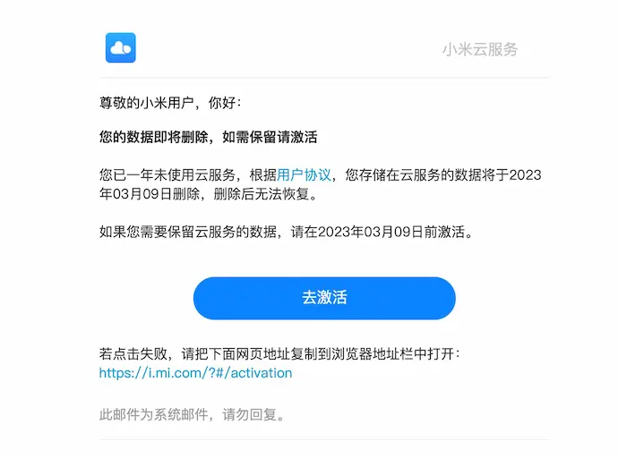

犹记得我使用过的最后一部小米手机是 [红米 Note 4X](https://www.mi.com/redminote4x) —— 当年的千元机性价比之王，陪我走过了大学的青春岁月，记录了许多美好回忆。不过毕业之后，我就再没用过小米手机。

直到有一天，我在邮箱里收到了「小米云服务存储数据即将清空」的通知邮件。

原以为小米云服务里的数据是永久保存的，原来长时间不用会被清空。

幸好我有经常看邮件的习惯，不然一个月之后就追悔莫及了。

遗憾的是，官方并没有提供「批量导出笔记」的功能。

没办法，只能自己造轮子了～
